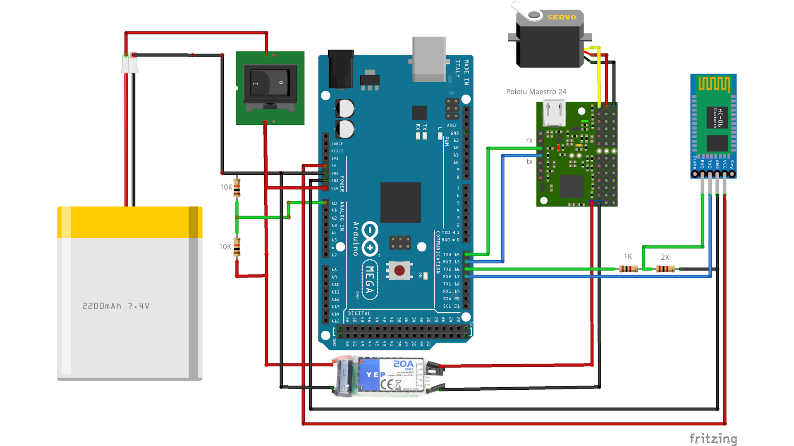
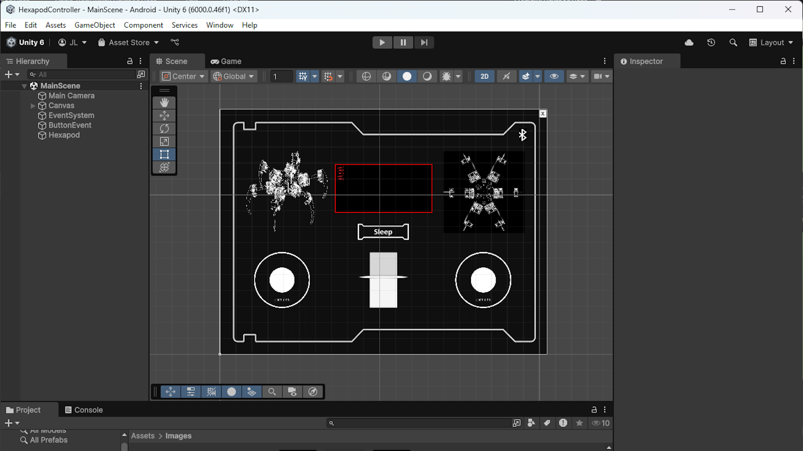

# Introduction 
This is the Arduino code and the print files for building a robot hexapod.

You can find a video on how to build the hexapod on this channel: https://www.youtube.com/@jakobleander

# Getting Started
Connect all the components like this

Run the various tests in the HardWare folder first to ensure each component is wired up correctly.

When all is working you can upload the full application in the hexapod folder to the robot.

# To control the robot
You can control the robot from a bluetooth device (not IOS) that can send serial commands.

To move the robot you send serial commands. The commands are in the format a character followed by a single digit.

The commands must be wrapped by [] to reduce risk of corrupted commands
- '(H#)' = Home
- '(S#)' = Sleep
- '(F#)' = Walk Forward
- '(B#)' = Walk Backward
- '(L#)' = Rotate Left
- '(R#)' = Rotate Right

The digits are not currently used but can later be used to control speed or size of steps.

# Unity App
You can use the unity app in the hexapod-app folder if you want

It does not work on IoS devices as HC06 module is not compatible with IoS.

I have used a paid 3-party component to handle low-level bluetooth communication, well worth it.

